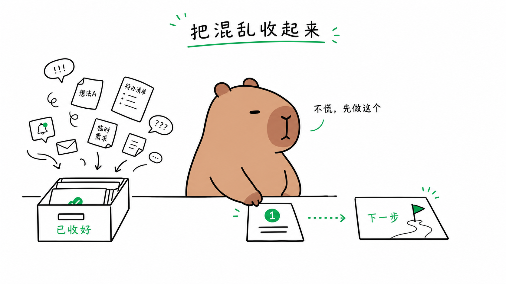
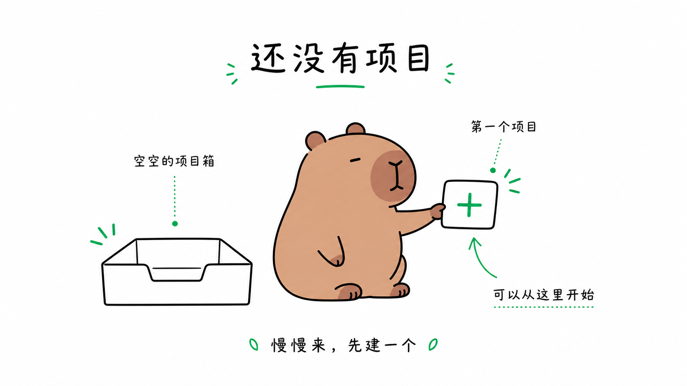

# Capybara Illustrations Skill

[中文](./README.md) | English

A Codex skill for turning ideas, articles, social posts, product states, open-source docs, tutorials, and slides into relaxed capybara illustrations with a calm, emotionally steady, mildly humorous vibe.

```text
Display name: Capybara Illustrations
Skill ID: capybara-illustrations
Usage: Use $capybara-illustrations ...
```

This is not a recolored stick-figure skill. It is a separate character-based visual system. The default subject is a capybara: round, calm, slow-moving, emotionally stable, cute without becoming childish.

If you need neutral explanatory sketches, flow visuals, or anonymous character scenes, use the companion repository: [stick-figure-illustrations](https://github.com/ZekerTop/stick-figure-illustrations).

The repository name stays simple and searchable: `capybara-illustrations`. The relaxed capybara vibe is part of the default visual rules.

## Defaults

Users do not need to repeat the basic visual requirements. When they provide an idea, article, scene, or desired meaning, the skill applies these defaults:

- Capybara subject, not a stick figure, hamster, bear, or fixed mascot
- `16:9` canvas by default unless the user specifies another format
- White or transparent-white background
- Black line art
- Soft warm-brown capybara fill plus one restrained accent color by default
- `mono`, `black and white`, or `no color` switches to pure black line art
- `soft-color` or `add some color` keeps a light color treatment
- Relaxed, emotionally steady expression, but with clear action
- Short title, state words, object labels, or one punchline by default
- One core idea per image
- No imitation of specific creators, brands, IP, illustrators, or public examples

Text is not minimized by default. The image should include enough short labels to make objects, states, and next actions understandable without turning into a slide full of copy.

## Good Fits

| Scenario | Output | Default format |
|---|---|---|
| Idea visuals | One-line ideas, punchlines, cognitive shifts | `16:9` |
| Articles / newsletters | Inline explainers, opening visuals, rhythm breaks | `16:9` / `3:2` |
| Social carousels | 5-8 pages, one action per page | `4:5` / `1:1` |
| SaaS states | Empty, error, loading, success, permission states | `1:1` / `3:2` / transparent spot |
| Open-source README docs | Install, config, issue, PR, release flow | `16:9` / `2:1` |
| Slides | Section breaks, idea-side illustrations | `16:9` |
| Tutorials / courses | Step visuals, exercises, feedback loops | `16:9` / `4:3` |

## Install

### Recommended: Ask Codex to install it

Open a new Codex thread and send:

```text
Please install this Codex skill:
https://github.com/ZekerTop/capybara-illustrations
```

Codex will read the skill folder in this repository and install it into your local skills directory.

### Local source install

```bash
mkdir -p "${CODEX_HOME:-$HOME/.codex}/skills"
cp -R ./capybara-illustrations "${CODEX_HOME:-$HOME/.codex}/skills/"
```

Then restart or refresh Codex.

## Quick Start

Generate one idea visual:

```text
Use $capybara-illustrations to create an illustration for this idea:

"Good tools put the mess away and place the next step in front of you."
```



Use monochrome line art:

```text
Use $capybara-illustrations with mono mode for this idea:

"Not everything needs to be solved immediately. Some things should first go into a box."
```

Plan article illustrations first:

```text
Use $capybara-illustrations to read the article below. Do not generate images yet.

<paste article>
```

Generate a SaaS empty-state illustration:

```text
Use $capybara-illustrations with the saas-state preset:

State: The user has not created any projects yet.
```



Plan a social carousel:

```text
Use $capybara-illustrations with the carousel preset. Do not generate images yet.

Topic: How one person turns AI into a daily workflow
```

## Presets

| Preset | Use | Count | Format | Focus |
|---|---|---:|---|---|
| `idea` | Single idea visual | 1 | `16:9` | Turn one line into a capybara action scene |
| `article` | Blog posts and essays | 3-6 | `16:9` | Real cognitive anchors, not decorative filler |
| `newsletter` | Email and weekly notes | 1-3 | `16:9` | Light rhythm and emotional relief |
| `carousel` | Social carousel | 5-8 | `4:5` / `1:1` | One action or contrast per page |
| `saas-state` | Empty, error, permission, loading, success | 1 | `1:1` / `3:2` / transparent spot | Clear state and next action |
| `readme` | Open-source README and contribution docs | 2-4 | `16:9` | Friendly technical explanation |
| `slides` | Talks and decks | 3-8 | `16:9` | Support the point without stealing hierarchy |
| `course` | Tutorials and courses | 4-10 | `16:9` / `4:3` | Learning actions and feedback loops |

## Relationship

`capybara-illustrations` and `stick-figure-illustrations` are separate skills:

- [`stick-figure-illustrations`](https://github.com/ZekerTop/stick-figure-illustrations): neutral anonymous stick figures for lightweight explainers.
- `capybara-illustrations`: capybara character scenes for relaxed, emotionally steady, more playful idea visuals.

Keeping them separate avoids mixing two subjects and two visual personalities in one skill.
